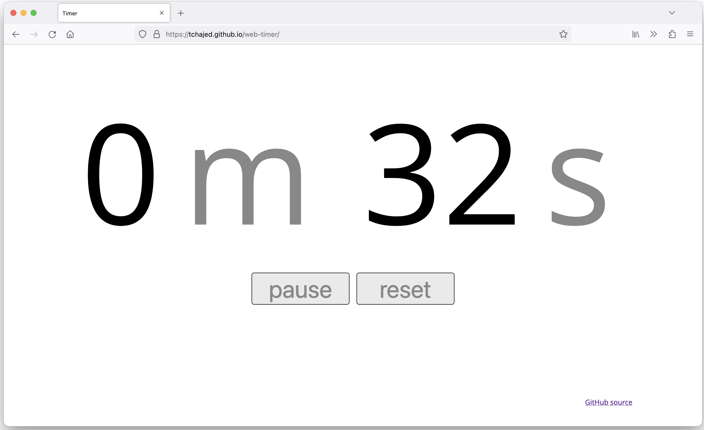

# Timer

[](https://github.com/tchajed/web-timer/actions/workflows/main.yml)

Web-based timer for tracking time on a task.

Keyboard shortcuts:
- space to pause/resume
- r to reset
- p to pause
- e to edit task description

[](https://tchajed.github.io/web-timer/)

## Developing

We use [Parcel](https://parceljs.org/) to build and develop.

```sh
npm install
npm run build
```

Run `npm run start` to run the parcel development server. This is an alias for
`npx parcel serve`.
